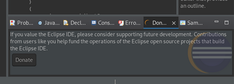

# Eclipse Sponsor View

This is a work-in-progress. There's lots of rough corners here. Not the least of which is that this is 
currently only a plug-in; there is no feature or other corresponding support for distribution.

This project provides a prototype _Sponsor_ view for the Eclipse Platform that is used to... well... solicit sponsorships.

The _Sponsor_ request needs to feel integrated, be “in-your-face”, but also easily dismissable, following the 
example of Mozilla's Thunderbird. The basic idea is that it is there for the user to see, but doesn't actually 
get in their way. 

When the Eclipse application opens, this prototype opens the _Sponsor_ view if it has not already been opened. 
If it is already open, the view is brought to the top whenever the IDE is started. The user will see it, but 
has no obligation to interact with the view in order to start working with the IDE. The user can just leave the 
view open (or close it) and it won't bother them again until the next time the application is launched.

When the user clicks on the "Sponsor" button, the system browser is opened pointing to the eclipse.org "IDE Sponsor"
page.

Bringing the view to the top on start up means that the corresponding plug-in needs to be loaded at startup. 
Out of respect for all of the work that’s been done by the Eclipse Project teams to improve start up and reduce 
footprint, we need to keep this tight. Additionally, the memory footprint should be as reasonable as possible. 
To that end, based on an observation that Webkit and Chromium browsers have incredibly large memory requirements, 
we’ve experimented with using SWT widgets to populate the _Sponsor_ view.

One of the things that we get for free by using SWT widgets is fidelity with the rest of the platform.

Here’s what the prototype looks like in Light Mode:

Or in Dark Mode:

## License

Distributed under the terms of the Eclipse Public License 2.0

SPDX-License-Identifier: EPL-2.0
